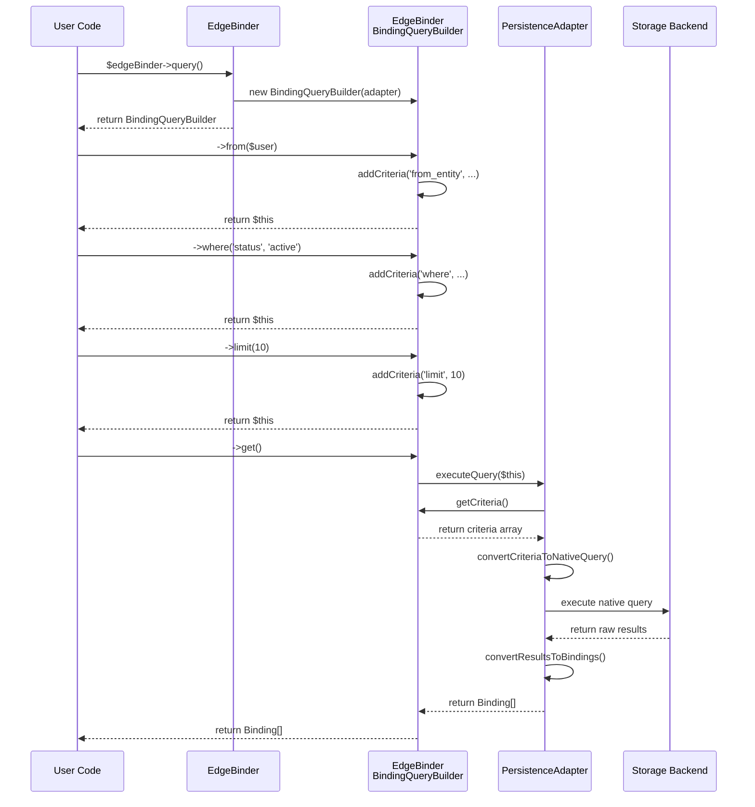

# EdgeBinder BindingQueryBuilder Architecture

## Overview

The EdgeBinder BindingQueryBuilder system provides a unified query interface that allows applications to query relationship bindings across different persistence adapters (Weaviate, Neo4j, etc.) using a consistent API. This document explains how the system works and how adapters should implement query support.

## Core Components

### 1. EdgeBinder's BindingQueryBuilder
- **Location**: `EdgeBinder\Query\BindingQueryBuilder`
- **Purpose**: Provides the public API for building queries
- **Responsibility**: Collects query criteria and delegates execution to the adapter

### 2. Adapter-Specific Query Builders
- **Example**: `EdgeBinder\Adapter\Weaviate\Query\BasicWeaviateQueryBuilder`
- **Purpose**: Implements adapter-specific query logic
- **Responsibility**: Converts generic query operations to adapter-native queries

### 3. PersistenceAdapterInterface
- **Method**: `executeQuery(QueryBuilderInterface $query): array`
- **Purpose**: Executes queries and returns results as EdgeBinder Binding objects
- **Responsibility**: Converts between EdgeBinder queries and adapter-native queries

## Query Flow Architecture

The query system follows a delegation pattern where EdgeBinder's BindingQueryBuilder collects criteria and delegates execution to the adapter:

```
User Code → EdgeBinder → BindingQueryBuilder → Adapter → executeQuery() → Results
```

## How It Works

### 1. Query Building Phase

When a user calls `$edgeBinder->query()`, EdgeBinder returns its own `BindingQueryBuilder` instance. This builder collects query criteria through method chaining:

```php
$query = $edgeBinder->query()
    ->from($user)                    // Add from entity filter
    ->to($project)                   // Add to entity filter  
    ->type('collaboration')          // Add binding type filter
    ->where('status', 'active')      // Add metadata filter
    ->limit(10);                     // Add pagination
```

Each method call adds criteria to an internal criteria array without executing anything.

### 2. Query Execution Phase

When `->get()` is called, EdgeBinder's BindingQueryBuilder:

1. **Passes itself to the adapter**: Calls `adapter->executeQuery($this)`
2. **Adapter converts the query**: The adapter's `executeQuery()` method receives the EdgeBinder BindingQueryBuilder
3. **Adapter executes native query**: Converts EdgeBinder criteria to adapter-specific query format
4. **Results conversion**: Adapter converts native results back to EdgeBinder Binding objects

### 3. Critical Implementation Details

#### EdgeBinder BindingQueryBuilder Structure
The EdgeBinder BindingQueryBuilder stores criteria in an internal format:

```php
$criteria = [
    ['type' => 'from_entity', 'value' => ['type' => 'User', 'id' => 'user123']],
    ['type' => 'to_entity', 'value' => ['type' => 'Project', 'id' => 'proj456']],
    ['type' => 'binding_type', 'value' => 'collaboration'],
    ['type' => 'where', 'value' => ['field' => 'status', 'operator' => '=', 'value' => 'active']],
    ['type' => 'limit', 'value' => 10]
]
```

#### Adapter Query Conversion
Adapters must implement `executeQuery()` to handle EdgeBinder's BindingQueryBuilder:

```php
public function executeQuery(QueryBuilderInterface $query): array
{
    // Handle EdgeBinder's BindingQueryBuilder
    if ($query instanceof \EdgeBinder\Query\BindingQueryBuilder) {
        $criteria = $query->getCriteria();
        $nativeQuery = $this->convertCriteriaToNativeQuery($criteria);
        $results = $this->executeNativeQuery($nativeQuery);
        return $this->convertResultsToBindings($results);
    }
    
    // Handle adapter's own query builder (for direct adapter usage)
    if ($query instanceof AdapterSpecificQueryBuilder) {
        // Handle adapter-specific query logic
    }
    
    throw new UnsupportedQueryException();
}
```

## Adapter Implementation Requirements

### 1. Query Method
Adapters should provide their own query builder for direct usage:

```php
public function query(): QueryBuilderInterface
{
    return new AdapterSpecificQueryBuilder($this->client, $this->config);
}
```

### 2. ExecuteQuery Method
Must handle both EdgeBinder's BindingQueryBuilder and adapter-specific builders:

```php
public function executeQuery(QueryBuilderInterface $query): array
{
    if ($query instanceof \EdgeBinder\Query\BindingQueryBuilder) {
        return $this->executeEdgeBinderQuery($query);
    }
    
    if ($query instanceof AdapterSpecificQueryBuilder) {
        return $this->executeAdapterQuery($query);
    }
    
    throw new UnsupportedQueryException();
}
```

### 3. Criteria Conversion
Convert EdgeBinder criteria to adapter-native query format:

```php
private function convertCriteriaToNativeQuery(array $criteria): NativeQuery
{
    $filters = [];
    
    foreach ($criteria as $criterion) {
        switch ($criterion['type']) {
            case 'from_entity':
                $filters[] = $this->createFromEntityFilter($criterion['value']);
                break;
            case 'to_entity':
                $filters[] = $this->createToEntityFilter($criterion['value']);
                break;
            case 'binding_type':
                $filters[] = $this->createBindingTypeFilter($criterion['value']);
                break;
            case 'where':
                $filters[] = $this->createWhereFilter($criterion['value']);
                break;
        }
    }
    
    return new NativeQuery($filters);
}
```

## Common Implementation Issues

### 1. Query Builder Type Confusion
**Problem**: Adapters only handle their own query builder type
**Solution**: Always check for both EdgeBinder's BindingQueryBuilder and adapter-specific builders

### 2. Criteria Access
**Problem**: Trying to call adapter-specific methods on EdgeBinder's BindingQueryBuilder
**Solution**: Use `getCriteria()` method to access query criteria from EdgeBinder's builder

### 3. Filter Application
**Problem**: Filters not being applied (returning all results instead of filtered results)
**Solution**: Ensure criteria conversion properly maps to native query filters

### 4. Result Conversion
**Problem**: Native results not converted back to EdgeBinder Binding objects
**Solution**: Always convert native results using the adapter's binding mapper

## Testing Query Implementation

The AbstractAdapterTestSuite provides comprehensive tests that verify:

1. **Query filtering works correctly**: Filters are applied and return correct results
2. **All query methods are supported**: from(), to(), type(), where(), etc.
3. **Complex query scenarios**: Multiple filters, pagination, ordering
4. **Edge cases**: Empty results, invalid criteria, etc.

### Critical Test Case
The most important test is `testExecuteQueryFiltersAreProperlyApplied` which creates multiple bindings and verifies that queries with filters return only matching results, not all results.

## Best Practices

1. **Always support both query builder types** in `executeQuery()`
2. **Use comprehensive logging** during development to trace query conversion
3. **Test with AbstractAdapterTestSuite** to ensure compliance
4. **Handle edge cases** like empty criteria, null values, unsupported operators
5. **Maintain consistent result format** - always return EdgeBinder Binding objects
6. **Implement proper error handling** with meaningful exception messages

This architecture ensures that applications can use a consistent query API regardless of the underlying persistence technology, while allowing adapters to optimize queries for their specific capabilities.

## Detailed Sequence Diagram

The following sequence diagram shows the exact method calls and data flow during query execution:



## Key Data Structures

### EdgeBinder Criteria Format
```php
[
    [
        'type' => 'from_entity',
        'value' => [
            'type' => 'User',
            'id' => 'user123'
        ]
    ],
    [
        'type' => 'where',
        'value' => [
            'field' => 'status',
            'operator' => '=',
            'value' => 'active'
        ]
    ],
    [
        'type' => 'limit',
        'value' => 10
    ]
]
```

### Adapter Query Conversion Example (Weaviate)
```php
// EdgeBinder criteria → Weaviate Filter
$criteria = $query->getCriteria();
$filters = [];

foreach ($criteria as $criterion) {
    switch ($criterion['type']) {
        case 'from_entity':
            $filters[] = Filter::allOf([
                Filter::byProperty('fromEntityType')->equal($criterion['value']['type']),
                Filter::byProperty('fromEntityId')->equal($criterion['value']['id'])
            ]);
            break;
        case 'where':
            $filters[] = Filter::byProperty($criterion['value']['field'])
                ->equal($criterion['value']['value']);
            break;
    }
}

$weaviateQuery = $collection->query()->where(Filter::allOf($filters));
```

## Troubleshooting Common Issues

### 1. "Query filters not applied" - Returns all results instead of filtered results

**Symptoms**:
- Tests like `testExecuteQueryFiltersAreProperlyApplied` fail
- Query returns 80+ results when expecting 2
- Debug shows "CRITICAL BUG: Query filters not applied!"

**Root Cause**:
The adapter's `executeQuery()` method doesn't handle EdgeBinder's `BindingQueryBuilder` properly.

**Solution**:
```php
public function executeQuery(QueryBuilderInterface $query): array
{
    // MUST handle EdgeBinder's BindingQueryBuilder
    if ($query instanceof \EdgeBinder\Query\BindingQueryBuilder) {
        $criteria = $query->getCriteria();
        return $this->executeEdgeBinderQuery($criteria);
    }

    // Handle adapter's own query builder
    if ($query instanceof AdapterSpecificQueryBuilder) {
        return $this->executeAdapterQuery($query);
    }

    throw new UnsupportedQueryException();
}
```

### 2. "Method getCriteria() not found"

**Symptoms**:
- Fatal error when calling `$query->getCriteria()`
- Adapter tries to call adapter-specific methods on EdgeBinder's query builder

**Root Cause**:
Trying to call adapter-specific methods on EdgeBinder's `BindingQueryBuilder`.

**Solution**:
Always check query type first and use appropriate methods for each type.

### 3. "Query builder returns wrong type"

**Symptoms**:
- `$edgeBinder->query()` returns `EdgeBinder\Query\BindingQueryBuilder`
- `$adapter->query()` returns adapter-specific query builder
- Type confusion in tests

**Root Cause**:
Not understanding the dual query builder system.

**Solution**:
- Use `$edgeBinder->query()` for application code (consistent API)
- Use `$adapter->query()` for adapter-specific features or direct testing
- Always handle both types in `executeQuery()`

### 4. "Immutable query builder breaks chaining"

**Symptoms**:
- Query methods return new instances instead of modifying current instance
- Filters not accumulated properly
- Method chaining doesn't work as expected

**Root Cause**:
Query builder uses immutable pattern (returns new instance) instead of mutable pattern (returns `$this`).

**Solution**:
Use mutable pattern for query builders:
```php
public function where(string $field, mixed $operator, mixed $value = null): static
{
    $this->whereConditions[] = [
        'field' => $field,
        'operator' => $operator,
        'value' => $value
    ];

    return $this; // NOT: return new self(...)
}
```

### 5. "Results not converted to EdgeBinder format"

**Symptoms**:
- Native storage objects returned instead of EdgeBinder Binding objects
- Type errors when accessing binding properties
- AbstractAdapterTestSuite tests fail with type mismatches

**Root Cause**:
Adapter returns native results without converting to EdgeBinder Binding objects.

**Solution**:
Always convert results using the adapter's binding mapper:
```php
public function executeQuery(QueryBuilderInterface $query): array
{
    $nativeResults = $this->executeNativeQuery($query);

    // MUST convert to EdgeBinder Binding objects
    return $this->convertResultsToBindings($nativeResults);
}
```

## Summary

The EdgeBinder BindingQueryBuilder system provides a powerful abstraction that allows consistent querying across different storage backends. The key to successful implementation is:

1. **Understand the dual query builder system** - EdgeBinder's for consistency, adapter's for optimization
2. **Always handle both query types** in `executeQuery()`
3. **Use `getCriteria()` to access EdgeBinder query data** - don't try to call adapter methods
4. **Convert results to EdgeBinder format** - never return native storage objects
5. **Test thoroughly with AbstractAdapterTestSuite** - it catches the critical bugs

This architecture enables EdgeBinder to provide a database-agnostic relationship management system while allowing adapters to optimize for their specific storage capabilities.
